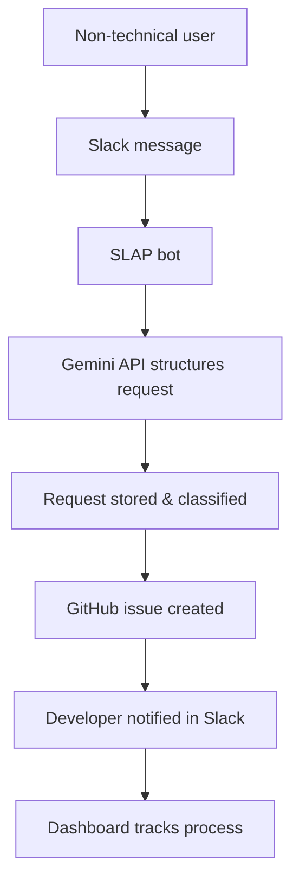
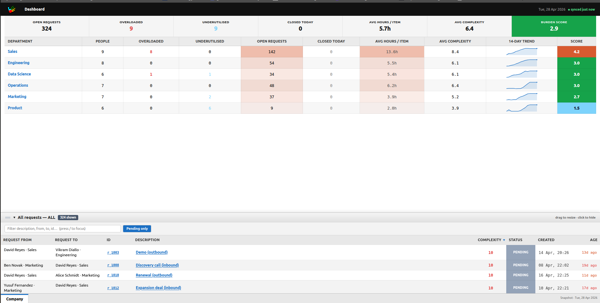
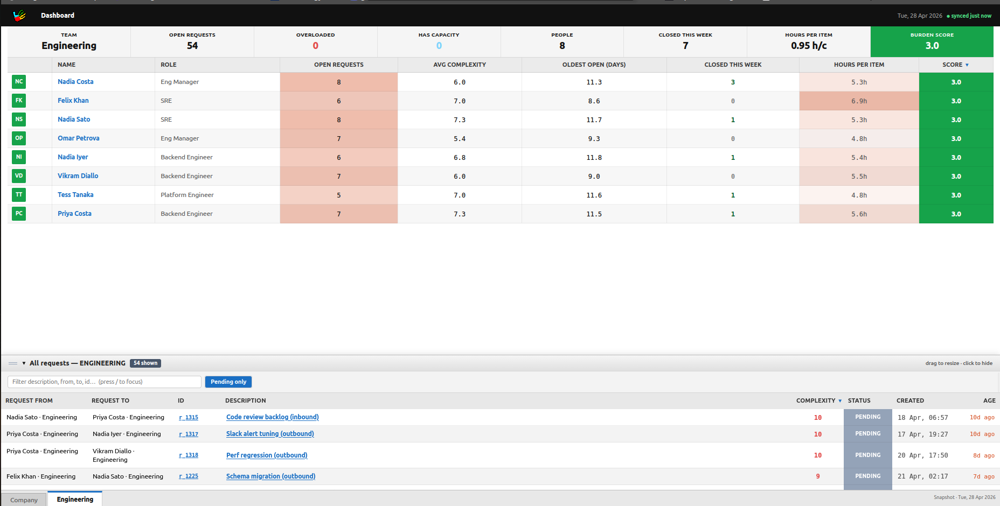
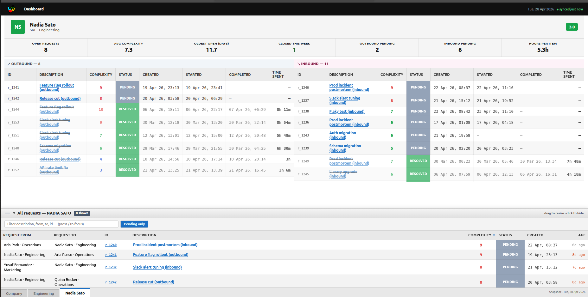

# SLAP

```text
🏆 1st Place — Bending Spoons Challenge @ HackUPC
```

**From Slack messages to actionable GitHub issues — without wasting engineering time.**

SLAP is a workflow automation tool that helps non-technical teams report small but costly infrastructure and website errors directly from Slack. Instead of sending emails, chasing managers, waiting for someone to translate the problem into technical language, and manually creating a task, SLAP turns a simple Slack message into a structured, trackable GitHub issue ready for developer review.

Built for teams where everyone notices problems, but only a few people have the technical context to fix them.

---

## The Problem

In most companies, non-technical team members often detect small errors in digital infrastructure before developers do.

A wrong date on a landing page.
A broken number in a pricing section.
A typo in a public-facing website.
A small UI inconsistency.
A piece of outdated copy that damages trust.

These issues are usually simple to describe, but surprisingly expensive to process.

A typical workflow looks like this:

1. A non-technical employee notices an error.
2. They write an email or Slack message to someone technical — or to a manager.
3. The manager asks for clarification.
4. Someone manually forwards the issue to a developer.
5. The developer asks for more context.
6. A GitHub issue or task is eventually created.
7. The fix finally enters the engineering workflow.

The problem is not the fix itself.
The problem is everything around the fix.

Companies lose time not because the typo is hard to correct, but because the path between noticing the problem and assigning the fix is slow, unclear, and full of unnecessary communication.

SLAP removes that friction.

---

## Our Solution

SLAP is a Slack bot that acts as a bridge between non-technical teams and engineering workflows.

A team member writes a simple message in Slack describing the problem. SLAP processes that message using an LLM, structures the request, connects it with the relevant GitHub repository, creates a pending GitHub issue, and notifies the responsible developer or team member.

At the same time, SLAP keeps every request visible through a monitoring dashboard where the team can track status, complexity, age, and progress.

In short:

> **SLAP turns messy workplace messages into structured engineering tasks.**

---

## What SLAP Does

SLAP helps teams report, organize, assign, and monitor small infrastructure issues without forcing non-technical employees to understand GitHub, tickets, repositories, or developer workflows.

When a user reports an issue through Slack, SLAP:

1. Receives the message from Slack.
2. Uses the Gemini API to understand and structure the request.
3. Extracts key information such as requester, description, complexity, status, creation date, and age.
4. Connects with GitHub to locate the relevant infrastructure repository.
5. Creates a GitHub issue pending developer approval.
6. Notifies the assigned developer or person in charge through Slack.
7. Displays all requests in a web dashboard for tracking and monitoring.

---

## Why It Matters

SLAP is designed around a simple idea:

> The people who notice problems should not need to understand the technical workflow required to fix them.

By reducing communication overhead, SLAP allows companies to:

* Save engineering and management time.
* Avoid duplicated or lost requests.
* Give non-technical teams a simple way to report issues.
* Keep developers inside their existing GitHub workflow.
* Track every request from report to resolution.
* Reduce the delay between detecting a problem and acting on it.

SLAP does not replace developers.
It protects their time.

---

## Example Use Case

A marketing team member sees this on the company website:

> “The event starts on May 15, 2024.”

But the correct date is May 15, 2025.

Instead of emailing the engineering team, they send a Slack message to SLAP:

```text
The date on the events page is wrong. It says May 15, 2024 but it should be May 15, 2025.
```

SLAP converts that into a structured request:

| Field        | Value                                                                       |
| ------------ | --------------------------------------------------------------------------- |
| Request From | Marketing team member                                                       |
| ID           | REQ-001                                                                     |
| Description  | Update the event date on the events page from May 15, 2024 to May 15, 2025. |
| Complexity   | Low                                                                         |
| Status       | Pending approval                                                            |
| Created      | 2026-04-26                                                                  |
| Age          | 0 days                                                                      |

Then SLAP creates a GitHub issue and notifies the responsible developer in Slack.

The developer receives a clear, actionable task instead of a vague message buried in a conversation.

---

## Key Features

### Slack-first reporting

SLAP lives where teams already work. Non-technical users do not need to open GitHub, create tickets, or learn a new platform. They simply write the problem in Slack.

### LLM-powered request structuring

Using the Gemini API, SLAP transforms natural language into clean, structured task data. Every request becomes easier to classify, assign, prioritize, and monitor.

### GitHub integration

SLAP connects directly with GitHub and creates issues inside the repository where the technical work actually happens. Developers stay in their existing workflow.

### Developer notification

Once a request is created, SLAP notifies the assigned developer or person responsible for the task through Slack.

### Request dashboard

SLAP includes a web dashboard where teams can see all incoming requests, their status, complexity, age, and progress.

### Human approval

SLAP is built to assist, not blindly modify production systems. Issues are created as pending tasks so developers can review, approve, modify, or reject them.

---

## Request Lifecycle



---

## System Architecture

SLAP is composed of four main parts:

### 1. Slack Bot

The Slack bot is the entry point for users. It receives messages, captures requests, and sends notifications back to the workspace.

### 2. LLM Processing Layer

The LLM layer uses the Gemini API to interpret the user's message and convert it into structured task data.

### 3. GitHub Integration

The GitHub integration creates issues in the relevant repository and allows developers to review and manage requests in their normal development environment.

### 4. Web Dashboard

The dashboard provides visibility over all requests, making it easier to monitor progress, identify bottlenecks, and understand how many small infrastructure issues are being reported over time.

---

## Tech Stack

* **Slack API** — user interaction and developer notifications.
* **Gemini API** — natural language understanding and request structuring.
* **GitHub API** — issue creation and repository integration.
* **Backend** — request processing, API orchestration, and data management.
* **Frontend dashboard** — request visualization and monitoring.
* **Database / storage layer** — request persistence and tracking.

---

## Data Model

Each request is represented with a structured format similar to:

```json
{
  "id": "REQ-001",
  "request_from": "marketing@company.com",
  "description": "Update the event date on the landing page from 2024 to 2025.",
  "complexity": "low",
  "status": "pending_approval",
  "created": "2026-04-26T10:30:00Z",
  "age": "0 days",
  "github_issue_url": "https://github.com/company/repo/issues/123",
  "assigned_to": "developer@company.com"
}
```

---

## Installation

### Prerequisites

Before running SLAP locally, make sure you have:

* Node.js installed.
* Python installed, if the backend uses Python.
* A Slack workspace where you can create and install apps.
* A GitHub account with access to the target repository.
* A Gemini API key.
* Git installed.

---

### 1. Clone the repository

```bash
git clone https://github.com/YOUR_ORGANIZATION/slap.git
cd slap
```

---

### 2. Install dependencies

If the project uses Node.js:

```bash
npm install
```

If the project uses Python:

```bash
pip install -r requirements.txt
```

If the project has separate frontend and backend folders:

```bash
cd backend
pip install -r requirements.txt

cd ../frontend
npm install
```

---

### 3. Configure environment variables

Create a `.env` file in the root of the project:

```bash
cp .env.example .env
```

Then add your credentials:

```env
SLACK_BOT_TOKEN=your_slack_bot_token
SLACK_SIGNING_SECRET=your_slack_signing_secret
GEMINI_API_KEY=your_gemini_api_key
GITHUB_TOKEN=your_github_token
GITHUB_REPOSITORY=owner/repository
DATABASE_URL=your_database_url
```

Never commit your `.env` file.

---

### 4. Run the backend

Example command:

```bash
npm run dev
```

Or, if using Python:

```bash
python app.py
```

---

### 5. Run the dashboard

If the dashboard is in a frontend folder:

```bash
cd frontend
npm run dev
```

The dashboard should be available at:

```text
http://localhost:3000
```

---

### 6. Connect Slack to your local server

For local development, expose your backend with a tunneling tool such as ngrok:

```bash
ngrok http 3000
```

Copy the generated HTTPS URL and configure it inside your Slack app under the request URL or event subscription settings.

Example:

```text
https://your-ngrok-url.ngrok-free.app/slack/events
```

---

## How to Use

### 1. Report an issue in Slack

A non-technical user sends a message to SLAP:

```text
The homepage says the discount ends on April 20, but it should say April 30.
```

### 2. SLAP processes the request

SLAP uses the Gemini API to extract the meaning, classify the complexity, and generate a clean technical description.

### 3. A GitHub issue is created

SLAP creates a GitHub issue with the structured information.

### 4. The developer is notified

The assigned developer receives a Slack notification with the issue summary and GitHub link.

### 5. The team tracks progress

The dashboard displays the request status, age, complexity, requester, and progress.

---

## GitHub Issue Format

SLAP generates GitHub issues with a clear structure:

```md
## Request Summary
Update the event date on the homepage from April 20 to April 30.

## Reported By
Marketing team

## Complexity
Low

## Status
Pending approval

## Context
The current homepage contains outdated campaign information.

## Suggested Action
Locate the homepage copy and update the campaign end date.

## Source
Created automatically from a Slack request using SLAP.
```

---

## Dashboard Overview

The SLAP dashboard gives teams a real-time overview of their internal request flow.

Possible dashboard metrics include:

* Total requests.
* Open requests.
* Approved requests.
* Rejected requests.
* Average request age.
* Requests by complexity.
* Requests by requester.
* Requests by assigned developer.
* GitHub issue status.

### Dashboard Company


### Dashboard Engineering


### Dashboard Employee (Nadia Sato)


---

## Authors

* Marina Dasca Bravo
* Nicholas Tchakov
* Víctor Asensio Bermudez
* Phoebe Iglesias Cividanes

---

## License

This project is currently developed for HackUPC purposes only.

Example:

```text
HackUPC 2026 License
```
##
